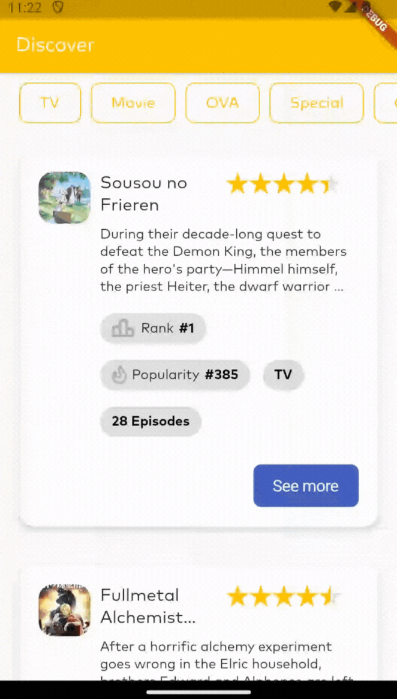

# dementia

Flutter anime app with jikan api. User can see top animes, filter animes, see anime details, see characters of anime, see reviews of anime, open trailer of anime, and see mal page of anime.

## Notes and Explanation

- Application uses bloc and hooks for state management. Bloc is used for global state management and hooks is used for local state management.
- go_router is used for routing. go_router_builder is used for building routes.
- https://api.jikan.moe/ api has a limit of 60 requests per minute.
- https://api.jikan.moe/v4/anime/5114/characters endpoint is used for getting characters of anime.
- https://api.jikan.moe/v4/anime/5114/reviews endpoint is used for getting reviews of anime.
- https://api.jikan.moe/v4/top/anime endpoint is used for getting top animes.
- Animes are coming with lazy load. So when user scrolls to bottom, it gets next page of animes.
- Application has filter for animes. User can filter animes by type, genre, score, status, and season. ["tv" "movie" "ova" "special" "ona" "music" "cm" "pv" "tv_special"]
- When app starts, app gets top animes from jikan api and shows it on home page.
- When user clicks an anime, it navigates to anime details page. And shows details of anime.
- When user clicks a characters, it navigates characters page and shows characters of anime.
- When user clicks reviews, it navigates reviews page and shows reviews of anime.
- Lotte package is used for animations.
- When user clicks youtube icon, it navigates to youtube and shows trailer of anime.
- When user clicks mal icon, it navigates to mal and shows mal page of anime.

 <br />

## Flavors


Dementia uses flavors for different environments. (Development, Staging, Production)

**Development:** Development environment for testing and debugging.

**Staging:** Staging environment for testing before production.

**Production:** Production environment for production.

<br />

## CI-CD


- Dementia uses github actions for CI-CD. When a push is made to main branch, it generate new version and tag. And uses this tag for versioning. Then it creates apk and ipa push it to stores. ( Deploy part is closed for this project )

  <br />

## Video Demo

https://drive.google.com/file/d/1pGzD25G78XWj44mz6pC170_5oto1foIQ/view?usp=sharing
[](https://drive.google.com/file/d/1pGzD25G78XWj44mz6pC170_5oto1foIQ/view?usp=sharing)

## Demo

#### Splash Screen


#### Lazy Load and Pagination


#### Filter Animes



#### Anime Details


#### Shimmer Effect on Loading


#### Characters of Anime


#### Reviews of Anime


#### Trailer of Anime and Mal Page of Anime


## Features

- Top animes
- Filter animes
- Pagination for animes
- Lazy load for animes
- Anime details
- Characters of anime
- Reviews of anime
- Trailer of anime
- Mal page of anime

<br />

## Used Packages and Versions

**Packages:** firebase_core, firebase_crashlytics get_it, flutter_bloc, bloc, flutter_hooks, http, internet_connection_checker_plus, freezed_annotation, json_annotation, cached_network_image, lottie, flutter_svg, go_router, talker_flutter, intl,
url_launcher, shimmer, collection, equatable, fpdart

**Flutter Version:** 3.7.12

<br />

## Logs and Crashs

- Application talker_flutter and talker_bloc_logger.
- Application uses crashlytics for crashs. There is a Observer for crashlytics. When an error occurs, talker logs it and sends it to crashlytics.

<br />

## Tests

- Router tests
- Bloc tests
- Widget tests
- Unit tests
- Some golden tests
- Some integration tests

<br />

## Used API Calls

#### Get top animes

```http
  GET https://api.jikan.moe/v4/top/anime
```

#### Get characters of anime

```http
  GET https://api.jikan.moe/v4/anime/5114/characters
```

#### Get reviews of anime

```http
  GET https://api.jikan.moe/v4/anime/5114/reviews
```

<br />

## Run

Application uses fvm for flutter version management. You can install fvm with this command.

```bash
  dart pub global activate fvm
```

Then you can use flutter version with this command.

```bash
  fvm use 3.7.12
```

Then you must generate files with this command.

```bash
  flutter packages pub run build_runner build

  # for build
  dart run build_runner --delete-conflicting-outputs

  # for watch
  dart run build_runner watch --delete-conflicting-outputs
```

Then you can run the application with this command.

```bash
# development flavor
  flutter run -t lib/main_development.dart --flavor development

# staging flavor
  flutter run -t lib/main_staging.dart --flavor staging

# production flavor
  flutter run -t lib/main_production.dart --flavor production
```
